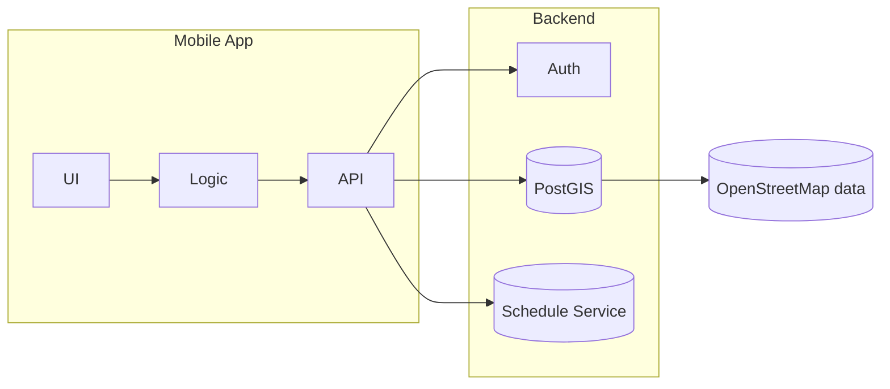

<h1 align="center">GEOMISIS</h1>
<p align="center">
  Навигация по кампусу НИТУ МИСИС<br/>
  <i>Mobile Campus Navigation App</i>
</p>


---

## О проекте
**GEOMISIS** — мобильное приложение для удобной навигации по кампусу НИТУ МИСИС. Сервис помогает студентам, преподавателям и гостям находить аудитории, столовые и другие точки интереса.

### MVP-функциональность
- картографическая основа кампуса
- интеллектуальный поиск аудиторий и корпусов
- построение маршрута с учётом этажности
- интеграция с расписанием и push-напоминаниями

### Целевая аудитория
| Группа | Проблема | Как решаем |
| ------ | -------- | ---------- |
| Первокурсники | Сложно ориентироваться в корпусах | Пошаговые маршруты + привязка к расписанию |
| Преподаватели | Перемещения между корпусами | Оптимальный маршрут + время в пути |
| Абитуриенты/родители | Найти аудиторию на Дне открытых дверей | QR-код на стенде → маршрут |
| Гости мероприятий | Навигация внутри кампуса | Каталог POI с фильтрами |

## Архитектура (план)


## Технологии
### Backend
- Python 3.11, FastAPI, Pydantic
- PostGIS + PgRouting, Redis (кэш маршрутов)
- OAuth2 аутентификация
- Docker Compose для развёртывания

### Frontend
- Flutter (iOS 14+ / Android 8+)
- Mapbox SDK с собственным стилем карт
- Управление состоянием через Riverpod

## Структура репозитория
- `backend/` — код FastAPI‑сервиса и Dockerfile
- `frontend/` — Flutter‑клиент приложения
- `docs/` — планирование: [дорожная карта](docs/Roadmap.md), [риски](docs/Risks.md), [аналогичные продукты](docs/Competitors.md), [стейкхолдеры](docs/Stakeholders.md)
- `design/` — макеты и ссылки на прототипы
- `seo/` — материалы для продвижения и [SEO‑стратегия](seo/SEO-Strategy.md)
- `docker-compose.yml` — запуск стека в контейнерах

## Быстрый старт
```bash
# Запускаем backend
docker-compose up --build

# В другой вкладке — Flutter (нужен установленный Flutter SDK)
cd frontend
flutter pub get
flutter run
```
После запуска API доступен на `http://localhost:8000/api/v1`.

## Дополнительная документация
В каталоге `docs/` можно найти материалы по развитию проекта. Для желающих помочь — оставляйте issues или отправляйте pull request.
